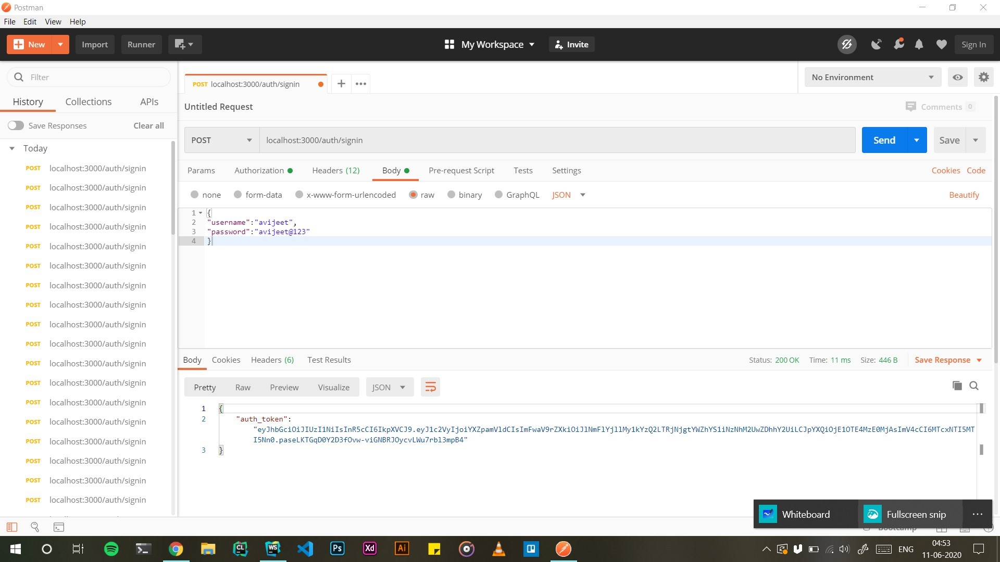
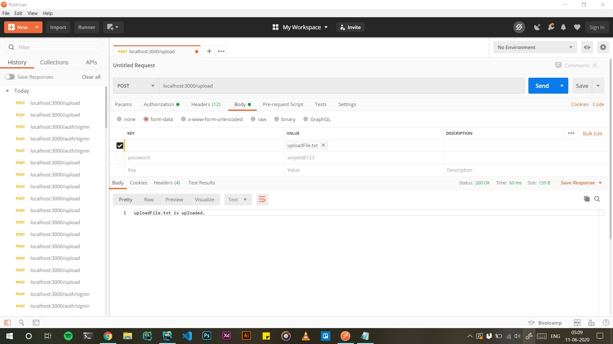

# Long Running Task Scheduler :rocket:


## Dependencies used :muscle:
- [x] NodeJs
- [x] ExpressJs  
- [x] Docker  

## Folder Structure

## Endpoints of The API

### 1. POST /auth/signin
```
POST : localhost:3000/auth/signin
```
 Returns back the auth token , which is neccessary for other requests on the server
accepts data in JSON format from body
 ```json
{
   "username":"avijeet",
   "password": "avijeet@123"
} 
 ```

 **Auth end-point screenshot**



### 2. POST /upload 
```
Set the following :-

header : auth_token
body ( form-data ) : file
```

Uploads the file in the **uploads folder** ,the file remains in a temprory folder untill completely uploaded
after that moves to upload directory

Gives message on succesful upload / abort 


**Upload File EndPoint**


### 3. DELETE /upload/kill
```
Set the following :- 
header : auth_token
```

Aborts the file upload by the user if user is currently in the upload jobQueue
else sends no upload found by user

### 4. POST /export
```
Set the following:-
header : auth_token
body ( json ) : filename
```

Exports the requested file if it already exists in the uploads folder

### 5. POST /export/kill
```
Set the following:-
header : auth_token
```

Terminates the file export that the user requested


### Approach to solve the task : :astronaut:
1. Generate JWT after verifying the credentials , using the dummy data
2. Place the auth_token for every API call afterwards for upload and export
3. For File Uploads 
    1. Create a job queue that contains all the instances of the data beign parsed
    2. Job queue is an object of username and password as key value pair
    3. when the upload endpoint is triggered , the data is parsed and stored in the uploads in root directory
    4. when abort endpoint is triggered , parsing is stoped and instance of the jobQueue is deleted
    
4. For Exports 
    1. Create the job queue that contains all data streams 
    2. job queue is an object of key value pairs of username and datastream
    3. when file abort is triggered , destroy the stream and delete the data stream instance in job queue 
    
    
 

 Thank you
